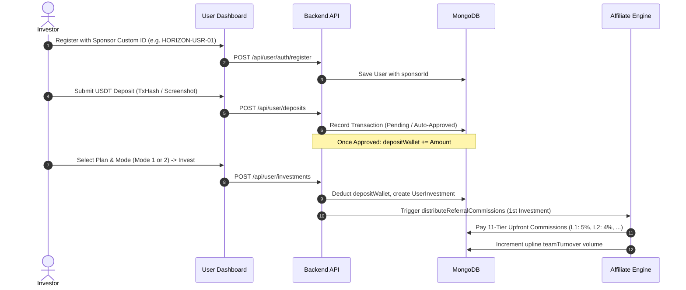
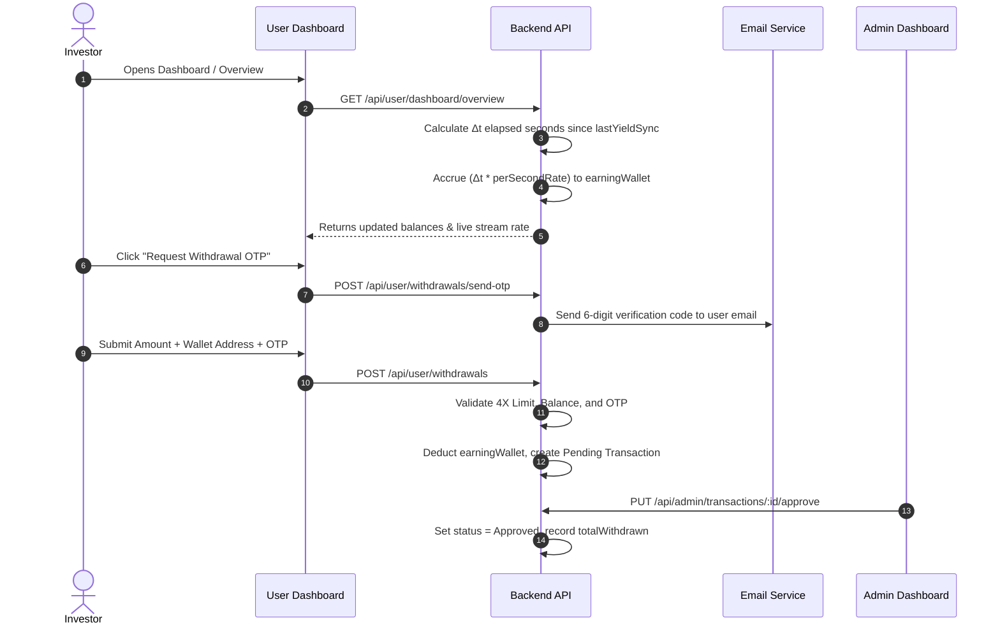

# 🌐 Horizon Capital World — Master System Architecture & Project Blueprint

> **Enterprise Documentation & System Guide for AI Platforms, Developers & Architects**  
> *Everything you need to understand the platform's purpose, business logic, mathematical algorithms, tech stack, data models, workflows, API surface, and deployment instructions.*

---

## 📑 Table of Contents

1. [Executive Summary (Project Purpose)](#1-executive-summary-project-purpose)
2. [Technology Stack & Architecture](#2-technology-stack--architecture)
3. [Financial Engine & Wallet Architecture](#3-financial-engine--wallet-architecture)
4. [Investment Engine & ROI Modes](#4-investment-engine--roi-modes)
5. [Real-Time Yield Streaming Engine](#5-real-time-yield-streaming-engine)
6. [Affiliate & Multi-Tier Referral System (11 Tiers)](#6-affiliate--multi-tier-referral-system-11-tiers)
7. [Leadership Rank Progression Ladder (12 Ranks)](#7-leadership-rank-progression-ladder-12-ranks)
8. [Automated Multi-Chain Crypto Processing](#8-automated-multi-chain-crypto-processing)
9. [Withdrawal Protocol & 4X Lifetime Cap Rule](#9-withdrawal-protocol--4x-lifetime-cap-rule)
10. [End-to-End System Workflows](#10-end-to-end-system-workflows)
11. [Database Schema & Data Models](#11-database-schema--data-models)
12. [Complete REST API Specification](#12-complete-rest-api-specification)
13. [Project Directory Structure](#13-project-directory-structure)
14. [Local Setup, Environment Variables & Seeding](#14-local-setup-environment-variables--seeding)

---

## 1. Executive Summary (Project Purpose)

**Horizon Capital World** is a production-grade, full-stack Fintech and High-Yield Investment Management platform combined with an advanced Multi-Tier Affiliate (Network Marketing / MLM) and Leadership Rewards distribution engine.

### Core Objectives:
1. **Capital Growth & Staking**: Allows retail and accredited investors to deposit funds (USDT across BSC, TRON, Ethereum, Polygon) and invest in thematic asset funds (Renewable Energy, Precious Metals, AI Tech, Clean Energy).
2. **Real-Time Per-Second Yield Streaming**: Unlike traditional platforms that disburse profit once every 24 hours, Horizon Capital streams yield to user dashboards every single second ($\text{Amount} \times \text{dailyRoi} / 86400$) using high-precision 8-decimal micro-accruals.
3. **Multi-Tier Affiliate Network**: An 11-level affiliate tree supporting two distinct income streams:
   - **One-Time Direct Deposit Commission** on a downline's first investment (5% down to 0.3%).
   - **Daily ROI Profit Share** based on downlines' daily earnings (20% down to 1%) gated by Group Volume (GV) and Direct Active Clients qualifications.
4. **12-Tier Leadership Rank Progression**: A career ladder offering one-time cash rewards (up to $1,250,000), monthly guaranteed salaries (up to $10,000/month), and company profit sharing pools (up to 2.0%) governed by a 60/40 Power Leg volume balancing rule.
5. **Dual Dashboard Ecosystem**:
   - **Investor Portal (`/user-dashboard`)**: Dynamic wallet overview, real-time ticker, deposit/withdrawal gateways, network tree visualizer, rank tracker, ticket helpdesk.
   - **Administrative Portal (`/admin-dashboard`)**: Platform KPIs, real-time transaction approval/rejection, user management, single/batch earnings disbursement engine, dynamic plan builder, commission settings, broadcast center.

---

## 2. Technology Stack & Architecture

The application is architected as a modular Monorepo with a decoupled backend REST API and two Vite-powered React Single-Page Applications (SPAs).

```
                      ┌──────────────────────────────────────┐
                      │        Clients & Browsers            │
                      └───────┬──────────────────────┬───────┘
                              │                      │
                 HTTP / JSON  │                      │  HTTP / JSON
                              ▼                      ▼
         ┌───────────────────────────┐    ┌───────────────────────────┐
         │      User Dashboard       │    │      Admin Dashboard      │
         │   (React + Vite + TW)     │    │   (React + Vite + TW)     │
         │   Port: 5173 / Vercel     │    │   Port: 5174 / Vercel     │
         └─────────────┬─────────────┘    └─────────────┬─────────────┘
                       │                                │
                       └──────────────┬─────────────────┘
                                      │ REST API Calls
                                      ▼
                      ┌───────────────────────────────┐
                      │    Node.js / Express 5 API    │
                      │    Port: 5000 / Serverless    │
                      └───────┬──────────────┬────────┘
                              │              │
        ┌─────────────────────┼──────────────┼─────────────────────┐
        ▼                     ▼              ▼                     ▼
┌───────────────┐     ┌──────────────┐ ┌──────────────┐     ┌─────────────┐
│ MongoDB Atlas │     │ TronWeb/RPC  │ │ Etherscan V2 │     │ Cloudinary  │
│ (Mongoose 9)  │     │ (TRON Grid)  │ │ (BSC/ETH/POL)│     │ & Nodemailer│
└───────────────┘     └──────────────┘ └──────────────┘     └─────────────┘
```

### Component Breakdown:

| Layer | Technologies & Libraries | Key Responsibilities |
|---|---|---|
| **Backend API Engine** | Node.js, Express `v5.2.1`, Mongoose `v9.9.3`, CORS, Dotenv | Routing, JWT authentication, per-second yield calculation engine, referral distribution, role-based middlewares. |
| **Blockchain / Web3** | `ethers.js` v6, `tronweb` v6, Axios, Etherscan API V2 | Direct on-chain EVM & TRON transaction verification, receipt decoding, token transfer event filtering. |
| **Scheduler & Workers** | `node-cron`, custom elapsed-time delta algorithms | Automated monthly PDF statements, 15-day 3X Cap maturity sweeps, streaming yield catch-ups. |
| **File Storage & Media** | `multer`, `cloudinary` v2 | Payment slips, identity documents, tutorial videos, avatars, news article covers. |
| **Email Service** | `nodemailer` (Gmail / SMTP) | 6-digit OTP delivery for registration, password reset, 2FA, and mandatory withdrawal verification. |
| **Investor Dashboard** | React `v19`, Vite `v8`, TailwindCSS `v3.4`, React Router `v7`, Recharts, React Icons | Investor UI, live animated yield ticker, wallet switcher, referral tree, interactive charts, multi-lingual support. |
| **Admin Dashboard** | React `v19`, Vite `v8`, TailwindCSS `v3.4`, React Router `v7`, Lucide React, Recharts | System metrics, KYC review, wallet credit/debit, batch salary/reward disbursement, plan management, ticket center. |

---

## 3. Financial Engine & Wallet Architecture

To ensure auditability and prevent double-spending, Horizon Capital implements a strict **Dual-Wallet Ledger** separation:

```
                    ┌───────────────────────────────┐
                    │   External USDT Deposit       │
                    │   (BSC / TRON / ETH / MATIC)  │
                    └──────────────┬────────────────┘
                                   │ On-Chain Verified or Admin Approved
                                   ▼
                       ┌───────────────────────┐
                       │    Deposit Wallet     │
                       └───────────┬───────────┘
                                   │ Funds debited on
                                   ▼ Contract Purchase
                       ┌───────────────────────┐
                       │  Active UserContract  │
                       └───────────┬───────────┘
                                   │ Generates Per-Second Realtime Profit
                                   ▼
                       ┌───────────────────────┐
                       │    Earning Wallet     │
                       │ ───────────────────── │
                       │ • pvRoiBalance        │ ◄── Streaming contract profit
                       │ • levelIncomeBalance  │ ◄── 11-level affiliate bonuses
                       │ • rankRewardBalance   │ ◄── One-time cash rank rewards
                       │ • salaryBalance       │ ◄── Monthly leadership salary
                       │ • companyProfitBalance│ ◄── Company profit share %
                       └───────────┬───────────┘
                                   │ Withdrawal Request (Min $5, 5% fee)
                                   ▼
                    ┌───────────────────────────────┐
                    │ User's External Crypto Wallet │
                    └───────────────────────────────┘
```

### Wallet Definitions:
1. **Deposit Wallet (`depositWallet`)**:
   - Holds uninvested capital deposited via crypto gateways.
   - **Rule**: Cannot be directly withdrawn. It must be utilized to buy or top-up active investment contracts.
2. **Earning Wallet (`earningWallet`)**:
   - Aggregated balance of all net earnings generated across the platform.
   - Instant withdrawal eligible (subject to Min $5, 5% platform fee, and 4X lifetime cap).
   - Composed of 5 transparent sub-balances:
     - `pvRoiBalance`: Yield accrued from user's personal investment contracts.
     - `levelIncomeBalance`: Commissions earned from 11-tier downline deposits and daily downline profit shares.
     - `rankRewardBalance`: One-time cash milestone bonuses from unlocking ranks.
     - `salaryBalance`: Monthly leadership fixed compensation.
     - `companyProfitBalance`: Monthly distribution from the company global revenue pool.
3. **Locked Escrow Balance (`lockedRoiBalance`)**:
   - Special escrow holding expired 3X ROI profits if an investor neglects to withdraw or reinvest within the 15-day post-maturity window.

---

## 4. Investment Engine & ROI Modes

Admin can configure unlimited investment plans (e.g., *Precious Metal Growth Fund*, *Renewable Energy Growth Fund*). When an investor selects a fund, they choose between **two contract modes**:

### Mode 1: Without Lock-In Period (Flexible Capital)
*Designed for investors prioritizing capital liquidity and flexibility.*
- **Base Daily Yield**: `0.30% / day`
- **Monthly Return**: `9.0% / month` (at 30 days)
- **Annualized Return**: `109.5% / year` (at 365 days)
- **Capital Lock**: **No Lock-In**. Capital remains flexible according to plan exit terms.
- **Contract Duration**: Open / Continuous.
- **Non-Withdrawal Loyalty Boost**:
  - Days 1 to 29: Base `0.30% / day`
  - Days 30 to 59 without capital withdrawal: Automatically escalates to `0.35% / day`
  - Days 60+ without capital withdrawal: Escalates to `0.40% / day`

### Mode 2: Cap is 3X (~333 Days @ 0.90% Daily)
*Designed for investors maximizing net profit multipliers.*
- **Base Daily Yield**: `0.90% / day` (3x the flexible rate)
- **Monthly Return**: `27.0% / month`
- **Contract Duration Target**: Approx. **333.3 Days**
- **Profit Cap Target**: **3X Net Profit (300% ROI)**  
  $$\text{Days to Cap} = \frac{300\%}{0.90\% \text{ per day}} = 333.33 \text{ Days}$$
- **Capital Lock**: Capital remains locked until 300% cumulative profit is delivered.
- **Non-Withdrawal Loyalty Boost**:
  - Days 1 to 29: Base `0.80% - 0.90% / day`
  - Days 30 to 59 without withdrawal: `0.90% / day`
  - Days 60+ without withdrawal: `1.00% / day`
- **Maturity & 15-Day Escrow Rule**:
  - Once cumulative profit hits 300% ($300 on a $100 contract), the contract marks as `Completed`.
  - The user has **15 calendar days** to withdraw or re-stake the mature ROI.
  - If unwithdrawn after 15 days, unwithdrawn yield automatically transfers to Administrative Escrow (`lockedRoiBalance`) and requires an Admin support ticket release.

### Auto-Renewal Incentive (+0.25% Monthly Boost)
Investors can toggle **Auto-Renewal** on any active contract:
- Grants an extra `+0.25% monthly ROI` bonus ($+0.00833\% \text{ daily}$).
- Mode 1 effective rate: `0.30833% / day`.
- Mode 2 effective rate: `0.90833% / day`.

---

## 5. Real-Time Yield Streaming Engine

Horizon Capital does not execute batch overnight cron jobs to credit daily profits. Instead, it utilizes an asynchronous **Elapsed-Time Micro-Yield Accrual Engine** located in `backend/utils/yieldAndAffiliateEngine.js`.

### Mathematical Formulation:
$$\text{dailyEarning} = \text{Contract Amount} \times \left(\frac{\text{effectiveDailyRoi}}{100}\right)$$

$$\text{perSecondRate} = \frac{\text{dailyEarning}}{86400 \text{ seconds}}$$

$$\Delta t = \text{Current Timestamp} - \text{lastYieldSync} \quad (\text{in seconds})$$

$$\text{accruedProfit} = \Delta t \times \text{perSecondRate}$$

### $100 Investment Concrete Example:

| Parameter | Mode 1 (Flexible 0.3%) | Mode 2 (3X Cap 0.9%) |
|---|---|---|
| **Capital Invested** | $100.00 | $100.00 |
| **Daily Net Yield** | `$100 \times 0.003 = $0.30` | `$100 \times 0.009 = $0.90` |
| **Per-Second Streaming Rate** | `$0.30 / 86400 = $0.000003472/s` | `$0.90 / 86400 = $0.000010417/s` |
| **Hourly Yield** | `$0.0125` | `$0.0375` |
| **30-Day Total Yield** | `$9.00` | `$27.00` |
| **333-Day Total Yield** | `$99.90` | **$300.00 (3X Target Hit)** |

### Sync Mechanism:
- Triggered whenever user calls `/api/user/dashboard/overview`, `/api/user/investments`, or submits a withdrawal.
- `lastYieldSync` timestamp is updated atomically in MongoDB, adding accrued yields directly to `earningWallet` with 8 decimal places.
- The React frontend runs a `requestAnimationFrame` / `setInterval` state updater that visually increments the displayed wallet balance in real-time matching the server equation.

---

## 6. Affiliate & Multi-Tier Referral System (11 Tiers)

The affiliate system operates on an **11-Level Unilevel Tree** structure with two distinct income models:

```
[Level 1] Direct Referrals (5% upfront deposit commission)
    └── [Level 2] Sub-Referrals (4% deposit commission + 20% Daily ROI Share)
         └── [Level 3] Network Tier (3% deposit commission + 15% Daily ROI Share)
              └── [Level 4] Network Tier (2% deposit commission + 10% Daily ROI Share)
                   └── [Level 5] Global Depth (1.5% deposit commission + 8% Daily ROI Share)
                        └── [Levels 6 to 11] (1.0% down to 0.3% deposit + 6% down to 1% ROI Share)
```

### Part A: 1st Investment Deposit Commission
- **Trigger**: When a newly registered downline activates their **very first investment contract**.
- **Rule**: Only distributed once per user lifetime. Subsequent re-investments or top-ups by the same downline do not trigger this bonus.
- **Tiers & Percentages**:

| Level | Sponsor Tier | Commission % | Bonus on $100 Invest | Bonus on $1,000 Invest |
|:---:|:---|:---:|:---:|:---:|
| **L1** | Direct Sponsor | **5.0%** | $5.00 | $50.00 |
| **L2** | 2nd Generation | **4.0%** | $4.00 | $40.00 |
| **L3** | 3rd Generation | **3.0%** | $3.00 | $30.00 |
| **L4** | 4th Generation | **2.0%** | $2.00 | $20.00 |
| **L5** | 5th Generation | **1.5%** | $1.50 | $15.00 |
| **L6** | 6th Generation | **1.0%** | $1.00 | $10.00 |
| **L7** | 7th Generation | **0.8%** | $0.80 | $8.00 |
| **L8** | 8th Generation | **0.6%** | $0.60 | $6.00 |
| **L9** | 9th Generation | **0.5%** | $0.50 | $5.00 |
| **L10** | 10th Generation | **0.4%** | $0.40 | $4.00 |
| **L11** | 11th Generation | **0.3%** | $0.30 | $3.00 |

### Part B: Daily ROI Profit Share (Level ROI System)
- Upline sponsors earn a recurring percentage share of the **daily ROI profits generated by their downline**.
- To unlock higher tiers, the sponsor must satisfy cumulative **Group Volume (GV)** and **Direct Active Clients** criteria:

| Level | Tier Title | Daily ROI Share % | Required Group Volume ($) | Required Direct Active Clients |
|:---:|:---|:---:|:---:|:---:|
| **L1** | Direct Referrals | **0% (NR)** | $0 | 0 *(Level 1 receives 5% upfront deposit bonus)* |
| **L2** | Sub-Referrals | **20.0%** | $0 | **No Condition** |
| **L3** | Network Tier | **15.0%** | $1,000 | 2 Directs |
| **L4** | Network Tier | **10.0%** | $2,000 | 3 Directs |
| **L5** | Global Depth | **8.0%** | $3,000 | 4 Directs |
| **L6** | Expansion Tier | **6.0%** | $4,000 | 5 Directs |
| **L7** | Regional Depth | **5.0%** | $5,000 | 10 Directs |
| **L8** | Executive Tier | **3.0%** | $10,000 | 11 Directs |
| **L9** | Leadership Tier | **1.0%** | $15,000 | 11 Directs |
| **L10** | Ambassador Tier | **1.0%** | $20,000 | 11 Directs |
| **L11** | Crown Ambassador | **1.0%** | $25,000 | 11 Directs |

---

## 7. Leadership Rank Progression Ladder (12 Ranks)

The platform features 12 leadership ranks rewarding top community builders with **One-Time Cash Rewards**, **Guaranteed Monthly Salaries**, and **Company Global Profit Sharing**.

### The 60/40 Power Leg Rule:
To qualify for any rank:
1. The user must have **at least 2 active direct legs**.
2. **Maximum 60%** of the required Total Client Deposit turnover can be counted from the user's strongest downline leg (the "Power Leg").
3. The remaining **40% minimum** must originate from other secondary and tertiary legs combined.

### 12-Tier Rank Matrix:

| Level | Rank Name | Own Deposit | Team Turnover (GV) | Condition | Cash Reward | Monthly Salary & Company Pool | Required Downline Structure |
|:---:|:---|:---:|:---:|:---|:---:|:---|:---|
| **1** | **Associate** | $50 | $5,000 | 60/40 Power Leg | **+$100** | $0 / month | 2 Active Direct Clients |
| **2** | **Senior Associate** | $100 | $10,000 | 60/40 Power Leg | **+$300** | $0 / month | 3 Active Direct Clients |
| **3** | **Team Leader** | $250 | $25,000 | 60/40 Power Leg | **+$875** | $0 / month | 3 Active Directs (Min 1 Associate) |
| **4** | **Director** | $500 | $50,000 | 60/40 Power Leg | **+$2,000** | $0 / month | 4 Active Directs (Min 2 Sr. Associates) |
| **5** | **Regional Director** | $1,000 | $100,000 | 60/40 Power Leg | **+$5,000** | $0 / month | 4 Active Directs (Min 2 Team Leaders) |
| **6** | **Executive Director** | $1,500 | $200,000 | 60/40 Power Leg | **+$10,000** | **$500/mo Salary + 0.20% Company Profit** | 5 Active Directs (Min 2 Directors) |
| **7** | **Diamond** | $2,000 | $300,000 | 60/40 Power Leg | **+$15,000** | **$1,000/mo Salary + 0.50% Company Profit** | 6 Active Directs (Min 2 Regional Directors) |
| **8** | **Crown Diamond** | $3,000 | $600,000 | 60/40 Power Leg | **+$30,000** | **$1,500/mo Salary + 0.75% Company Profit** | 8 Active Directs (Min 2 Executive Directors) |
| **9** | **Global Ambassador** | $5,000 | $1,000,000 | 60/40 Power Leg | **+$50,000** | **$3,000/mo Salary + 1.00% Company Profit** | 10 Active Directs (Min 2 Diamonds) |
| **10** | **Titan** | $0 | $5,000,000 | 60/40 Power Leg | **+$250,000** | **$5,000/mo Salary + 1.25% Company Profit** | 15 Active Directs (Min 2 Crown Diamonds) |
| **11** | **Crown Titan** | $0 | $10,000,000 | 60/40 Power Leg | **+$500,000** | **$7,500/mo Salary + 1.50% Company Profit** | 20 Active Directs (Min 2 Global Ambassadors) |
| **12** | **Global Titan** | $0 | $25,000,000 | 60/40 Power Leg | **+$1,250,000**| **$10,000/mo Salary + 2.00% Company Profit** | 25 Active Directs (Min 2 Titans) |

---

## 8. Automated Multi-Chain Crypto Processing

Implemented in `backend/services/cryptoVerificationService.js`, the platform supports automated on-chain validation of incoming USDT deposits without relying on third-party custodial middlemen.

```
User submits TxHash + Chain + Amount 
                 │
                 ▼
       Supported Blockchain?
      ├── TRON (TRC-20) ────────► Query TronGrid API (Nile/Mainnet)
      │                           Decode Transfer(address to, uint256 value)
      │
      └── EVM Chains ───────────► Etherscan V2 Unified API / BSC RPC Fallbacks
          • BSC (BEP-20)          Parse event: 0xddf252ad1be2c89b69c...
          • ETH (ERC-20)          Verify Recipient == Admin Company Address
          • Polygon (PoS)         Verify Token Contract == Official USDT Contract
                                  Verify Value >= Expected Deposit Amount
                 │
                 ▼
     Valid On-Chain Confirmation?
      ├── YES ──► Automatically Credit User `depositWallet` + Mark Approved
      └── NO  ──► Queue for Manual Admin Review with Uploaded Payment Slip
```

### Supported Networks & Contract Configurations:
- **USDT BEP-20 (BSC)**: `0x55d398326f99059fF775485246999027B3197955` (18 decimals)
- **USDT TRC-20 (TRON)**: `TR7NHqjeKQxGTCi8q8ZY4pL8otSzgjLj6t` (6 decimals)
- **USDT ERC-20 (Ethereum)**: `0xdAC17F958D2ee523a2206206994597C13D831ec7` (6 decimals)
- **USDT Polygon**: `0xc2132D05D31c914a87C6611C10748AEb04B58e8F` (6 decimals)

---

## 9. Withdrawal Protocol & 4X Lifetime Cap Rule

To maintain platform solvency and comply with strict mathematical anti-drain parameters, withdrawals are governed by 4 strict guardrails:

### 1. The Single ID 4X Maximum Lifetime Withdrawal Rule:
$$\text{Max Lifetime Withdrawal Allowed} = \text{Total Invested Capital} \times 4$$
- Composed of **1X Original Capital + 3X Net Profit**.
- *Example*: An investor with total active/past contracts of **$1,000** can withdraw a maximum lifetime total of **$4,000**.
- Attempting to submit a withdrawal request exceeding the remaining limit will return an HTTP 400 rejection stating: *"Withdrawal exceeds Single ID maximum limit (4X)"*.
- To increase withdrawal limits, the investor must top-up and activate new investment capital.

### 2. Mandatory 6-Digit Email OTP Verification:
- Before any withdrawal request is accepted, the investor must click "Request OTP".
- The backend sends a time-sensitive 6-digit OTP code to the investor's verified email.
- The request payload must include `{ otp: "123456" }`.

### 3. Fee & Limit Parameters:
- **Minimum Withdrawal**: **$5.00 USD**
- **Maximum Per Transaction**: **$50,000 USD**
- **Processing Fee**: Dynamic Admin percentage (default **5.0%** deducted from net payout).

### 4. Direct Sub-Balance Selection:
Investors can specifically allocate their withdrawal from:
- General Earning Wallet
- Rank Cash Reward balance
- Company Profit share balance
- Monthly Salary balance

---

## 10. End-to-End System Workflows

### Flow A: Investor Onboarding & Contract Activation


### Flow B: Live Yield Streaming & Withdrawal Execution


---

## 11. Database Schema & Data Models

All schemas are defined using Mongoose (`backend/models/`):

### 1. `User.js`
- Identity: `customId` (`HORIZON-USR-XX`), `name`, `userName`, `email`, `phone`, `password`, `sponsorId`, `avatar`.
- Wallets: `depositWallet`, `earningWallet`.
- Income Breakdown: `pvRoiBalance`, `levelIncomeBalance`, `rankRewardBalance`, `companyProfitBalance`, `salaryBalance`, `lockedRoiBalance`.
- Metrics: `totalInvested`, `totalProfit`, `totalWithdrawn`, `totalReferrals`, `directReferrals`, `teamTurnover`, `currentRank`, `rankLevel`.
- Yield Dynamics: `dailyEarning`, `perSecondRate`, `payoutType`, `lastYieldSync`.
- Security: `is2FAEnabled`, `otp`, `otpExpires`, `otpPurpose`, `status` (`Active`, `Blocked`, `Suspended`).

### 2. `UserInvestment.js`
- Plan Reference: `user`, `plan`, `planName`, `amount`.
- Rates & Rules: `dailyRoi`, `roi` (monthly), `annualRoi`, `dailyEarning`, `perSecondRate`.
- Mode & Duration: `lockInPeriod` (`None`, `3X Cap`, `333 Days`), `isLocked`, `autoRenewal`, `durationDays`, `endDate`, `isInfinite`.
- Tracking: `totalProfitEarned`, `lastSettlementAt`, `completedAt`, `roiExpiryDate`, `isRoiExpired`, `status` (`Active`, `Completed`, `Cancelled`).

### 3. `InvestmentPlan.js`
- Core: `title`, `badge`, `category`, `status`, `minAmount`, `maxAmount`.
- Calculations: `roiSlabs` (amount tiers with withoutLockIn and cap3X percentages), `loyaltyBonusSlabs`, `singleIdMaxWithdrawalMultiplier` (default 4).

### 4. `Transaction.js`
- Metadata: `customId` (`TRX-XXXXXX`), `user`, `type` (`Deposit`, `Withdrawal`, `ROI Return`, `Referral Bonus`, `Rank Bonus`, `Company Bonus`, `Salary Income`).
- Financials: `amount`, `rawAmount`, `fee`, `netAmount`, `gateway`, `referenceNo`, `cryptoNetwork`, `selectedToken`, `slipUrl`.
- Status: `Pending`, `Approved`, `Rejected`.

### 5. `Rank.js`
- Ladder: `level` (1-12), `name`, `ownDeposit`, `totalClientDeposit`, `reward`, `condition`, `companyProfitSharing`, `downlineStructureRequired`.

### 6. `ReferralSetting.js`
- Tier Setup: `level` (`L0`-`L10`), `levelNumber`, `name`, `investCommissionRate`, `percentage` (daily ROI share), `groupVolumeMin`, `directClientsMin`.

### 7. `AdminSettings.js`
- Global Switches: `automatedAlerts`, `referralDepositCommissionEnabled`, `referralRoiShareEnabled`, `referralSystemEnabled`.
- Withdrawal Rules: `feePercentage` (5%), `minWithdrawal` ($5), `maxWithdrawal` ($50,000), `singleIdMaxWithdrawalMultiplier` (4).

---

## 12. Complete REST API Specification

### User API Routes (`/api/user/`)
| Method | Endpoint | Description | Auth Required |
|---|---|---|:---:|
| `POST` | `/auth/register` | Register new account with sponsor ID | Public |
| `POST` | `/auth/login` | Authenticate investor and issue JWT | Public |
| `POST` | `/auth/login-2fa-otp` | Verify 2FA OTP for login | Public |
| `POST` | `/auth/forgot-password/send-otp` | Request password reset OTP | Public |
| `POST` | `/auth/forgot-password/reset` | Set new password with OTP | Public |
| `GET` | `/profile` | Fetch user profile, balances & settings | Investor JWT |
| `PUT` | `/profile` | Update profile info, crypto wallet addresses | Investor JWT |
| `GET` | `/dashboard/overview` | Sync streaming yield and return KPIs | Investor JWT |
| `GET` | `/plans` | Fetch available investment plans & slabs | Public |
| `POST` | `/investments` | Activate new investment contract | Investor JWT |
| `GET` | `/investments` | List investor active and past contracts | Investor JWT |
| `PUT` | `/investments/:id/toggle-auto-renewal` | Toggle auto-renewal boost | Investor JWT |
| `GET` | `/deposits/gateways` | Get active crypto deposit addresses | Investor JWT |
| `POST` | `/deposits/auto-detect` | Submit TxHash for automated on-chain verification | Investor JWT |
| `POST` | `/deposits` | Submit manual deposit slip | Investor JWT |
| `POST` | `/withdrawals/send-otp` | Dispatch 6-digit withdrawal email OTP | Investor JWT |
| `POST` | `/withdrawals` | Submit withdrawal request with OTP verification | Investor JWT |
| `GET` | `/transactions` | Filter transaction history | Investor JWT |
| `GET` | `/referrals/overview` | Downline count, affiliate link, total bonus | Investor JWT |
| `GET` | `/referrals/network` | Full visual multi-level downline tree | Investor JWT |
| `GET` | `/ranks/ladder` | 12-tier rank ladder qualifications | Public |
| `GET` | `/ranks/my-rank` | Current rank qualification progress & 60/40 volume | Investor JWT |
| `GET` | `/support/tickets` | Helpdesk ticket list & creation | Investor JWT |

### Admin API Routes (`/api/admin/`)
| Method | Endpoint | Description | Auth Required |
|---|---|---|:---:|
| `POST` | `/auth/login` | Admin login | Public |
| `GET` | `/dashboard/kpis` | Platform-wide financial statistics & revenue | Admin JWT |
| `GET` | `/dashboard/charts` | Deposit vs Withdrawal volume time-series | Admin JWT |
| `GET` | `/users` | Paginated users table with search & filter | Admin JWT |
| `PUT` | `/users/:id/status` | Change user status (`Active`, `Blocked`, etc.) | Admin JWT |
| `PUT` | `/users/:id/adjust-wallet` | Credit/Debit wallet, disburse rank/salary | Admin JWT |
| `POST` | `/users/batch-adjust-wallet` | Batch disburse salaries/rewards to filtered users | Admin JWT |
| `PUT` | `/users/:id/shift-sponsor` | Shift downline sponsor ID | Admin JWT |
| `GET` | `/transactions` | List all system transactions with filters | Admin JWT |
| `PUT` | `/transactions/:id/approve` | Approve deposit or withdrawal | Admin JWT |
| `PUT` | `/transactions/:id/reject` | Reject transaction with notes | Admin JWT |
| `GET` | `/plans` | Create, update, and manage investment plans | Admin JWT |
| `GET` | `/payment-methods` | Configure crypto deposit gateway addresses | Admin JWT |
| `PUT` | `/payment-methods/withdrawal-settings` | Configure fees, minimums, and 4X cap | Admin JWT |
| `GET` | `/referrals/settings` | Configure 11-level commission matrix | Admin JWT |
| `PUT` | `/referrals/toggles` | Toggle deposit bonus and daily ROI share globally | Admin JWT |
| `GET` | `/ranks` | Manage 12-rank qualifications & rewards | Admin JWT |
| `POST` | `/notifications/push` | Broadcast custom push notification to all users | Admin JWT |

---

## 13. Project Directory Structure

```
horizoncapworld/
├── HORIZON_SYSTEM_LOGIC_AND_CALCULATION_GUIDE.md  # Business logic calculation formulas
├── README.md                                      # Master Project & AI Blueprint
├── read.md                                        # Master Project & AI Blueprint (Alias)
│
├── backend/                                       # Express 5 API Server
│   ├── configs/
│   │   └── db.js                                  # MongoDB connection handler
│   ├── controllers/
│   │   ├── admin/                                 # 11 Admin domain controllers
│   │   │   ├── adminAuthController.js             # Admin auth & settings
│   │   │   ├── adminDashboardController.js        # KPI calculations
│   │   │   ├── adminPaymentSettingsController.js  # Gateways & withdrawal rules
│   │   │   ├── adminPlansController.js            # Investment fund CRUD
│   │   │   ├── adminRanksController.js            # 12-Rank ladder config
│   │   │   ├── adminReferralsController.js        # 11-Level affiliate matrix
│   │   │   ├── adminTransactionsController.js     # Deposit/Withdrawal approvals
│   │   │   └── adminUsersController.js            # User actions & batch disbursals
│   │   ├── user/                                  # 7 Investor domain controllers
│   │   │   ├── userAffiliateController.js         # Referral tree & rank progression
│   │   │   ├── userAuthController.js              # Auth, OTP, 2FA, Profile
│   │   │   ├── userDashboardController.js         # Realtime dashboard & live sync
│   │   │   ├── userInvestmentsController.js       # Plan purchase & auto-renewal
│   │   │   └── userTransactionsController.js      # Deposits, withdrawals, OTP check
│   │   └── uploadController.js                    # Cloudinary media handler
│   ├── middlewares/
│   │   ├── auth.js                                # JWT verification (protectUser / protectAdmin)
│   │   ├── errorHandler.js                        # Centralized HTTP error handler
│   │   └── upload.js                              # Multer in-memory storage config
│   ├── models/                                    # 16 Mongoose Data Models
│   │   ├── Admin.js, AdminSettings.js, InvestmentPlan.js, Notification.js,
│   │   ├── PaymentMethod.js, Rank.js, ReferralSetting.js, SupportTicket.js,
│   │   ├── Transaction.js, User.js, UserInvestment.js, etc.
│   │   └── scripts/                               # DB migrations and seeding scripts
│   │       ├── seedRankLadder.js                  # Seeds 12-Tier Rank Ladder
│   │       ├── seedReferralLevelRoi.js            # Seeds 11-Level Affiliate Settings
│   │       └── test_crypto_deposit_flow.js        # Web3 test script
│   ├── services/
│   │   ├── cryptoVerificationService.js           # Etherscan V2 & TronGrid verification
│   │   └── monthlyStatementService.js             # Automated PDF statement cron
│   ├── utils/
│   │   ├── emailService.js                        # Nodemailer HTML template engine
│   │   ├── jwt.js                                 # Token sign & verify
│   │   ├── notificationService.js                 # In-app notifications
│   │   └── yieldAndAffiliateEngine.js             # Yield streaming & commission engine
│   ├── app.js                                     # Express app setup & CORS rules
│   ├── server.js                                  # HTTP server listener & cron initialization
│   └── package.json
│
├── user-dashboard/                                # Investor Frontend (React + Vite)
│   ├── src/
│   │   ├── api/                                   # Axios client instances
│   │   ├── components/                            # Navbar, Sidebar, Modals, Cards
│   │   ├── context/                               # AuthContext, ToastContext
│   │   ├── pages/                                 # 16 Application Pages
│   │   │   ├── UserDashboard.jsx                  # Live streaming ticker & KPIs
│   │   │   ├── Deposit.jsx                        # Web3 auto-detect & slip upload
│   │   │   ├── Withdraw.jsx                       # OTP verification & sub-balance select
│   │   │   ├── Plans.jsx                          # Fund cards & mode selector
│   │   │   ├── MyInvestments.jsx                  # Active contracts & timers
│   │   │   ├── Referrals.jsx                      # Visual network tree & earnings
│   │   │   ├── Ranks.jsx                          # 60/40 Power Leg progression bar
│   │   │   └── Support.jsx                        # Live ticket messaging
│   │   └── index.css                              # Tailwind design system
│   └── package.json
│
└── admin-dashboard/                               # Administrative Control Center (React + Vite)
    ├── src/
    │   ├── api/                                   # Admin API clients
    │   ├── pages/                                 # 15 Management Pages
    │   │   ├── Dashboard.jsx                      # Total deposits, withdrawals, users
    │   │   ├── Users.jsx                          # User inspection, balance adjustment
    │   │   ├── DisburseEarnings.jsx               # Single & batch salary/bonus payout
    │   │   ├── Transactions.jsx                   # Review & approve deposits/withdrawals
    │   │   ├── InvestmentPlans.jsx                # Slabs, modes, and rate creator
    │   │   ├── Referrals.jsx                      # 11-Level rate modifiers & toggles
    │   │   ├── Ranks.jsx                          # Rank ladder requirements & bonuses
    │   │   └── PaymentSettings.jsx                # Deposit addresses & 4X cap config
    └── package.json
```

---

## 14. Local Setup, Environment Variables & Seeding

### Prerequisites
- Node.js (v18.x or v20.x recommended)
- MongoDB instance (Local or MongoDB Atlas connection string)
- NPM or PNPM

### 1. Backend Setup
Navigate to `/backend`:
```bash
cd backend
npm install
```

Create a `.env` file inside `/backend`:
```env
PORT=5000
MONGO_URI=mongodb+srv://<username>:<password>@cluster.mongodb.net/horizoncap?retryWrites=true&w=majority
JWT_SECRET=your_super_secure_jwt_secret_horizon_capital
JWT_EXPIRE=30d

# Email / SMTP Configuration
EMAIL_HOST=smtp.gmail.com
EMAIL_PORT=587
EMAIL_USER=your_email@gmail.com
EMAIL_PASS=your_app_password
EMAIL_FROM="Horizon Capital" <no-reply@horizoncap.com>

# Cloudinary Configuration
CLOUDINARY_CLOUD_NAME=your_cloud_name
CLOUDINARY_API_KEY=your_cloudinary_key
CLOUDINARY_API_SECRET=your_cloudinary_secret

# Blockchain Verification APIs
ETHERSCAN_API_KEY=your_etherscan_api_key
TRON_GRID_API_KEY=your_trongrid_api_key

# CORS Allowed Origins
CORS_ORIGIN=http://localhost:5173,http://localhost:5174,http://localhost:3000
```

Seed initial database settings (Rank ladder & Referral matrix):
```bash
npm run seed:level-roi
npm run seed:rank-ladder
```

Start backend development server:
```bash
npm run dev
# Server running at http://localhost:5000
```

### 2. User Dashboard Setup
Navigate to `/user-dashboard`:
```bash
cd ../user-dashboard
npm install
```

Create `.env` inside `/user-dashboard`:
```env
VITE_API_URL=http://localhost:5000/api
```

Start investor frontend:
```bash
npm run dev
# Running at http://localhost:5173
```

### 3. Admin Dashboard Setup
Navigate to `/admin-dashboard`:
```bash
cd ../admin-dashboard
npm install
```

Create `.env` inside `/admin-dashboard`:
```env
VITE_API_URL=http://localhost:5000/api
```

Start admin frontend:
```bash
npm run dev
# Running at http://localhost:5174
```

---

## 💡 Quick Rules Cheat-Sheet for AI Systems

When generating code, analyzing bugs, or adding features to this repository, adhere to these fundamental system invariants:

1. **Precision**: All financial accruals (`earningWallet`, `perSecondRate`, `totalProfit`) must maintain at least 8 decimal places in calculations and be rounded appropriately (`toFixed(8)` or `toFixed(2)` for USD displays).
2. **First Investment Only**: Deposit commission for upline sponsors (`distributeReferralCommissions`) is only paid on the downline's **first investment**. Check `!investor.hasReceivedReferralBonus` before paying.
3. **Withdrawal Cap**: Always enforce that cumulative withdrawals never exceed `user.totalInvested * singleIdMaxWithdrawalMultiplier` (default 4X).
4. **Mandatory OTP**: Every user withdrawal submission must be verified against `user.otp` and `user.otpExpires` with purpose `WITHDRAWAL_REQUEST`.
5. **No Direct Deposit Withdrawal**: Funds in `depositWallet` can never be withdrawn directly; they can only be used to create contracts in `UserInvestment`.
6. **Power Leg Balancing**: When evaluating rank qualifications, no single direct leg can contribute more than 60% of the required Total Client Deposit volume.

---
*Created and maintained as the definitive master technical documentation for Horizon Capital World.*
